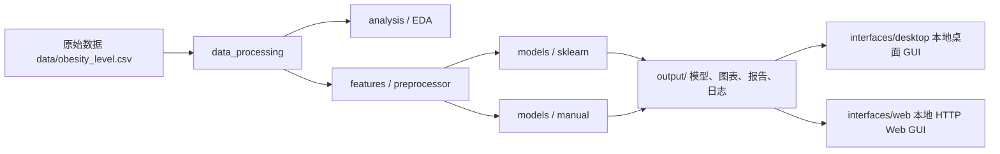

# 肥胖风险预测系统设计

一个面向《人工智能综合实践 / 课程设计》的完整机器学习项目示例。项目围绕肥胖风险预测展开，覆盖了**数据清洗、探索性分析、`sklearn` 建模、手搓模型实现、训练结果可视化、日志管理、桌面 GUI 与 Web GUI 演示**等完整流程。

> [!IMPORTANT]
> 本仓库中的命令都以**仓库根目录**为执行基准。

## 这个项目解决什么问题

很多课程设计项目只停留在“能训练出一个模型”，但很难把过程讲清楚、把结果展示清楚，也很难让别人拿到仓库后直接运行。本项目的目标不是只给出一个分类结果，而是把下面几件事一起做好：

- 让数据处理、建模、评估、可视化有一条完整主线。
- 同时保留 **工程化建模路线** 和 **算法原理实现路线** 两种视角。
- 给出适合答辩展示的图表、报告、日志和界面。
- 让命令、目录结构和运行方式都尽量可复现、可迁移、可共享。

## 项目特性

- **双训练路线**：同时支持 `sklearn` 模型族与手搓多分类模型族。
- **双界面模式**：支持本地桌面界面和本地 HTTP Web 界面，两条界面链路在 `src/` 中明确分离。
- **统一训练进度**：训练阶段重点展示“全流程百分比进度”，减少终端噪音。
- **参数摘要输出**：训练完成后统一输出各模型优化后的关键参数。
- **项目级日志体系**：基于 `loguru` 的统一日志模块，支持终端和文件双输出、`DEBUG/INFO/NOTICE/WARNING/ERROR/CRITICAL` 分级、日志轮转与保留策略；未安装时自动回退到标准库 `logging`。
- **结构化源码组织**：主实现已按模块归档。

## 现在的源码结构

```text
src/
├── analysis/                 # EDA 与分析摘要
├── data_processing/          # 数据读取、清洗、切分
├── evaluation/               # 指标计算、报告生成
├── features/                 # 特征工程与预处理
├── interfaces/
│   ├── desktop/              # 本地桌面 GUI
│   └── web/                  # Web 页面与 HTTP 服务
├── models/                   # sklearn 模型、手搓模型、训练器
├── serving/                  # 共享推理与模型加载逻辑
├── utils/                    # 日志、文件、进度等基础工具
├── visualization/            # 图表绘制
└── config.py                 # 项目配置读取
```

### 目录划分背后的思路

- `data_processing/` 只负责“把数据变干净、可切分”。
- `features/` 只负责“把数据变成模型能吃的特征”。
- `models/` 只负责“训练、保存、加载模型”。
- `interfaces/desktop` 和 `interfaces/web` 明确分开，避免 GUI 逻辑与 HTTP 服务逻辑混在一起。
- `serving/` 抽出两种界面都需要的推理共享逻辑，避免重复实现。

## 整体运行关系



## 快速开始

### 1. 准备环境

在仓库根目录执行：

```bash
python -m pip install -r requirements.txt
```

如果你已经在自己的虚拟环境中安装过依赖，可以直接跳过这一步。

### 2. 运行完整训练流程

```bash
python main.py train
```

这条命令会依次完成：

1. 读取并清洗数据
2. 生成 EDA 摘要与图表
3. 训练 `sklearn` 模型族
4. 训练手搓模型族
5. 汇总模型对比、参数摘要、报告与日志

### 3. 只运行某一条训练路线

仅训练 `sklearn`：

```bash
python main.py train-sklearn
```

仅训练手搓模型：

```bash
python main.py train-manual
```

## 两种 GUI 使用方式

### 方式一：本地桌面界面

这个模式**不依赖 HTTP 服务**，适合在本机直接演示。

```bash
python main.py gui-local
```

适用场景：

- 课堂答辩时希望直接弹出本地窗口
- 不想额外打开浏览器或启动本地 Web 服务
- 需要更明确地区分“桌面模式”和“网页模式”

### 方式二：本地 Web 界面（HTTP）

这个模式会启动本地 HTTP 服务，然后在浏览器中查看页面。

```bash
python main.py serve-web --host 127.0.0.1 --port 8000
```

兼容别名：

```bash
python main.py serve --host 127.0.0.1 --port 8000
```

启动后访问：

```text
http://127.0.0.1:8000
```

> [!NOTE]
> 这里默认提供的是**本地 HTTP 演示服务**，不是 HTTPS 部署。对于课程设计、本地展示和实验复现，这种方式已经足够直观，也更轻量。

## 单条样本预测

可以直接通过命令行输入一条 JSON 样本：

```bash
python main.py predict --json '{"gender":"Male","age":24,"height_m":1.75,"weight_kg":85,"family_history_with_overweight":1,"high_calorie_food_frequency":1,"vegetable_intake_score":2.0,"main_meals_per_day":3.0,"snacking_frequency":"Sometimes","smokes":0,"water_intake_liters":2.0,"calorie_monitoring":0,"physical_activity_score":1.0,"technology_use_hours":1.0,"alcohol_consumption":"Sometimes","transportation_mode":"Automobile"}'
```

## 训练时会看到什么

训练日志优先展示：

- **全流程百分比进度**
- **当前阶段名称**
- **阶段性关键信息**，例如数据量、当前最佳 `Macro F1`
- **训练结束后的优化参数汇总**

## 日志系统说明

日志文件默认写入：

```text
output/logs/project.log
```

日志体系分为两层：

1. **运行时终端日志**：重点展示整体进度、关键状态和异常告警。
2. **文件日志**：写入 `output/logs/project.log`，记录更完整的项目运行信息，便于回溯和排错。

当前实现使用 `loguru` 作为主日志方案，统一封装了项目级 logger、结构化组件字段、日志轮转和保留策略；如果当前环境尚未安装 `loguru`，程序会自动回退到标准库 `logging`，不会影响基本运行。

## 训练产物会输出到哪里

```text
output/
├── analysis/        # 清洗后数据、EDA 摘要
├── evaluation/      # 模型评估结果、训练仪表盘 JSON
├── figures/         # EDA 图、训练曲线、对比图
├── logs/            # 项目日志
├── models/          # 训练后模型与预处理器
├── predictions/     # 测试集预测结果
└── reports/         # Markdown 训练/评估报告
```

其中比较关键的产物包括：

- `output/evaluation/training_dashboard.json`
- `output/reports/final_summary.md`
- `output/reports/family_comparison_report.md`
- `output/logs/project.log`

## 测试命令

在仓库根目录执行：

```bash
python -m unittest tests/test_project_pipeline.py tests/test_sklearn_pipeline.py
```

## 文档索引

- 方案设计：`docs/方案设计.md`
- API 接口文档：`docs/API接口文档.md`
- 数据说明：`docs/数据说明.md`
- 测试说明：`docs/测试说明.md`
- 部署说明：`docs/部署说明.md`

## 当前已知边界

- Web 服务默认是本地 HTTP 演示模式，不包含生产级 HTTPS 部署配置。
- README 提供的是通用根目录命令，具体 Python 环境由使用者自行选择。
- `src/legacy/flat_layout/` 仅作历史归档，不建议在新开发中继续直接引用。

## Commit 提交规范
格式：`<type>(<scope>): <description>`

说明：
- `type` 表示提交类型
- `scope` 表示影响范围
- `description` 表示提交内容摘要，使用简洁、明确的中文或英文短语

常用 `type`：

| type | 说明 |
| --- | --- |
| `feat` | 新增功能 |
| `fix` | 修复问题 |
| `docs` | 修改文档 |
| `style` | 格式调整，不影响代码逻辑 |
| `refactor` | 重构代码，不新增功能也不修复问题 |
| `test` | 新增或修改测试 |
| `chore` | 构建、依赖、工具类变更 |
| `perf` | 性能优化 |
| `build` | 构建系统或依赖相关修改 |
| `ci` | 持续集成相关修改 |

提交要求：
- 一次提交只做一类事情，避免把无关修改混在一起
- `description` 尽量说明“做了什么”，不要只写“修改”“更新”
- 如果修改范围较小，`scope` 要尽量具体，方便后续追踪
