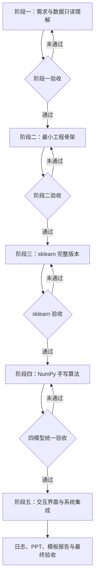
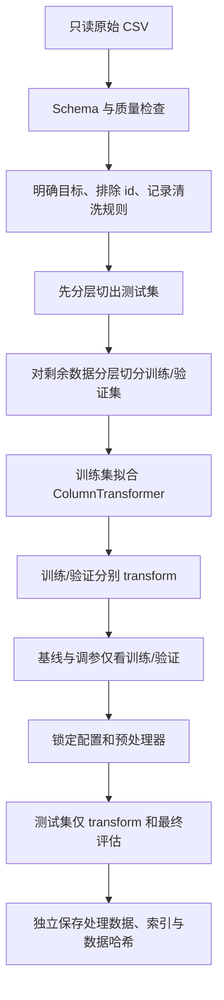
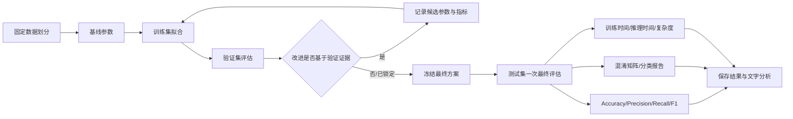
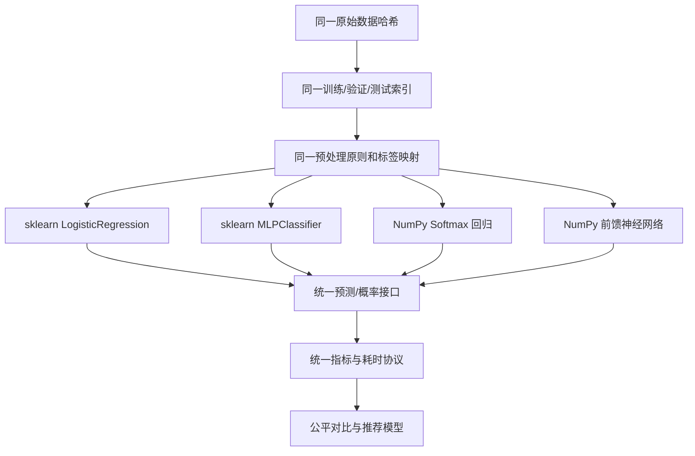
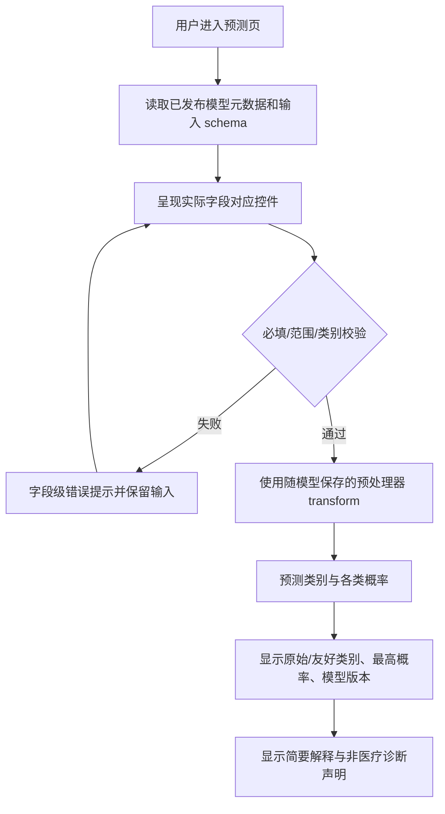

# 技术路线

## 技术原则

- Python 3.10，所有命令从指定 Conda 环境运行。
- YAML 驱动配置；`pathlib` 管理路径；`logging` 留存过程；pytest 验证边界。
- pandas/NumPy 完成数据计算，scikit-learn 完成成熟模型和 Pipeline；手写核心算法仅依赖 NumPy。
- 训练、验证、测试严格隔离；相同数据划分服务四个模型；界面只消费稳定服务接口和已验证产物。

## 项目总体流程图

## 数据处理流程图

## 模型训练和评估流程图

## sklearn 与手写算法关系图

## 用户预测流程图

## 数据划分与调参决策

- 初始计划比例：训练 70%、验证 15%、测试 15%，固定 `random_state=42`；阶段二写入 YAML，阶段三通过测试确认每类均覆盖且比例误差合理。
- 第一次分层切分保留 15% 测试集；第二次对余下 85% 按 `15/85` 比例切出验证集，避免直接比例计算错误。
- 若使用交叉验证，仅能在训练部分执行；验证集作为候选方案的统一比较依据，测试集保持封存。
- 所有模型消费持久化的样本索引/划分标识；不得各自重新随机划分。

## 预处理方案候选

- 连续数值列：训练集拟合缺失处理（即使当前无缺失也保留明确策略）和标准化。
- 二元/名义类别：训练集拟合缺失处理与 One-hot；对验证/测试未知类别使用明确策略。
- 序数候选列是否保持连续数值由字段说明和验证实验决定，决策记录在配置与实验元数据中。
- 标签：固定保存原始标签到整数索引的双向映射，展示层可另有友好文本映射。

## 产物与可复现证据

- 每次实验记录：数据哈希、划分索引/哈希、配置快照、代码版本、Python/依赖版本、开始/结束时间、模型、预处理器、标签映射、指标与图表。
- 图表必须有标题、轴、图例、编号候选和对应解释；报告只使用本人运行生成的图表/界面截图。

