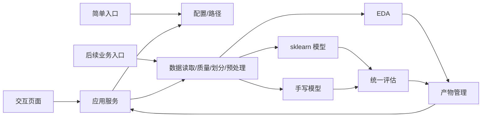

# 系统模块规划

## 当前阶段二实际结构

```text
config/
└── default.yaml
src/
└── obesity_risk/
    ├── __init__.py
    ├── __main__.py
    ├── config.py
    └── paths.py
tests/
├── test_config.py
└── test_paths.py
```

`data/obesity_level.csv` 是当前原始文件。阶段二不移动、不复制、不读取其内容，也不提前创建处理数据或输出目录。

## 后续阶段规划结构

阶段三及以后根据实际任务逐步增加 `data/`、`analysis/`、`models/`、`evaluation/`、`artifacts/`、`app/` 和 `outputs/` 等模块。只有进入数据处理、训练和实验记录后，才按实际需要增加日志能力，不预留独立空壳模块。

## 模块清单

| 模块 | 阶段/状态 | 职责 | 建议文件 | 测试重点 |
|---|---|---|---|---|
| 配置 | 阶段二已实现 | 读取并校验当前 YAML 配置 | `config.py` | 缺项、类型、比例和关键值 |
| 路径 | 阶段二已实现 | 固定根目录解析、路径防逃逸和原始数据保护 | `paths.py` | 越界、覆盖、目录冲突、文件缺失 |
| 简单入口 | 阶段二已实现 | 串联配置和路径检查 | `__main__.py` | `python -m obesity_risk` 成功运行 |
| 数据读取/质量 | 阶段三规划 | 只读加载 CSV、schema 与质量检查 | `data/` | 缺文件、格式错误、输入不变 |
| 数据划分/预处理 | 阶段三规划 | 固定分层三分和训练集拟合预处理 | `data/` | 互斥、复现、无泄漏 |
| EDA/模型/评估/产物 | 阶段三至四规划 | 分析、四模型训练、统一评估和产物保存 | 对应业务目录 | 指标、接口、可复现和公平比较 |
| 应用服务/交互页面 | 阶段五规划 | 五页面展示、训练、预测和比较 | `app/` | 输入校验、状态、结果和免责声明 |

## 调用关系



## 配置规划

当前 `config/default.yaml` 仅包含 `data`、`split` 和 `paths`。后续阶段只在功能实际实现时增加特征、预处理、模型、评估、图表或产物配置，不提前预留日志、模型和界面参数。

固定初值候选：`random_seed: 42`、训练/验证/测试 `0.70/0.15/0.15`、目标精确值 `0be1dad`、排除列 `[id]`。数值和类别字段清单必须与数据 schema 校验，不能默默忽略拼写错误。

## 输出规划

- `outputs/figures/<run_id>/`：PNG/SVG 图表与图表说明索引。
- `outputs/metrics/<run_id>/`：JSON 指标、CSV 对比、分类报告、运行元数据。
- `outputs/models/<run_id>/`：模型、预处理器、标签映射、输入 schema、清单和校验信息。
- 进入阶段三实验运行后，根据实际记录需求决定日志的保存方式和目录。
- 自动产物默认不与源代码提交混合；报告选用的稳定图表按交付策略另行纳入。

## 测试规划

- 当前测试为 `tests/test_config.py` 和 `tests/test_paths.py`。
- 阶段三及以后可按实际规模增加数据、模型、集成和界面测试；不提前建立空目录。
- 测试命令统一为 `python -m pytest`。
