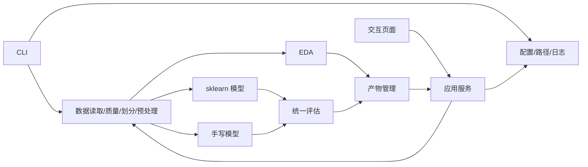

# 系统模块规划

## 建议目录（阶段二及后续逐步建立）

```text
2026-AI_CourseDesign/
├── config/default.yaml
├── data/
│   ├── obesity_level.csv
│   └── processed/
├── docs/requirements/
├── src/obesity_risk/
│   ├── cli.py
│   ├── config.py
│   ├── paths.py
│   ├── logging_setup.py
│   ├── data/
│   ├── analysis/
│   ├── models/
│   │   ├── sklearn/
│   │   └── manual/
│   ├── evaluation/
│   ├── artifacts/
│   └── app/
├── tests/
├── outputs/
│   ├── figures/
│   ├── metrics/
│   ├── models/
│   └── logs/
└── deliverables/
    ├── logs/
    ├── ppt/
    └── report/
```

`data/obesity_level.csv` 是当前已跟踪原始文件。本阶段不移动；阶段二若引入 `data/raw/`，必须先决定兼容路径并验证哈希，不能形成两个含义不清的“真源”。

## 模块清单

| 模块 | 职责 | 输入 | 输出 | 依赖 | 建议目录 | 测试重点 |
|---|---|---|---|---|---|---|
| 配置 | 读取、合并、校验 YAML | `config/default.yaml` | 类型明确的配置对象 | PyYAML 候选 | `config.py` | 缺项、比例和路径错误 |
| 路径 | 从仓库根解析路径并创建允许的输出目录 | 配置路径 | `Path` 对象 | pathlib | `paths.py` | 非法/缺失路径、禁止覆盖原始数据 |
| 日志 | 控制台和文件日志 | 日志配置 | logger/日志文件 | logging | `logging_setup.py` | 重复 handler、目录和级别 |
| 数据读取 | 只读 CSV 与 schema 验证 | 原始路径、目标名 | DataFrame、元数据 | pandas | `data/loader.py` | 缺文件、空文件、目标缺失 |
| 数据质量 | 缺失、重复、范围、类别、泄漏候选 | DataFrame | 质量报告 | pandas/NumPy | `data/quality.py` | 统计准确、不修改输入 |
| 数据划分 | 固定分层三分 | X、y、比例、种子 | 索引与数据集合 | scikit-learn | `data/split.py` | 互斥、覆盖、比例、可复现 |
| 预处理 | 训练拟合数值/类别变换 | 字段清单、训练数据 | transformer、变换矩阵 | scikit-learn | `data/preprocessing.py` | 只在训练拟合、未知类别 |
| EDA | 单/双/多变量图和文字摘要 | 数据与目标 | 图、表、分析元数据 | pandas/绘图库 | `analysis/` | 图表存在、字段真实、无写回 |
| sklearn 模型 | LR/MLP 构建、训练、概率 | 配置、处理数据 | 模型与训练元数据 | scikit-learn | `models/sklearn/` | API、随机种子、概率形状 |
| 手写数学 | 稳定 Softmax、交叉熵、激活 | 数组 | 损失/梯度/激活 | NumPy | `models/manual/math.py` | 数值稳定、有限差分 |
| 手写模型 | Softmax 回归与前馈网络 | 配置、数组 | 模型、损失曲线 | NumPy | `models/manual/` | 收敛、shape、predict/proba |
| 调参与实验 | 基线、候选、选择、计时 | 模型工厂、训练/验证集 | 最优配置与实验记录 | 上述模块 | `models/experiments.py` | 不访问测试集、记录完整 |
| 统一评估 | 分类指标、矩阵、报告、耗时 | y_true、预测/概率 | JSON/表/图 | sklearn.metrics | `evaluation/` | macro/weighted、标签顺序 |
| 产物管理 | 原子保存、版本、清单和加载 | 模型/结果/元数据 | outputs 文件 | joblib/JSON | `artifacts/` | 路径、版本、缺失/损坏 |
| 应用服务 | 为 UI 提供分析、训练、预测、比较接口 | 配置/产物/输入 | 结构化 ViewModel | 业务模块 | `app/services.py` | 隔离 UI 与核心逻辑 |
| 交互页面 | 五页面呈现和输入校验 | ViewModel、用户输入 | 页面与操作事件 | UI 框架待定 | `app/pages/` | 边界输入、状态和免责声明 |
| CLI | 最小命令入口 | 命令参数、配置 | 退出码、日志、产物 | 所有服务 | `cli.py` | help、错误码、最小 smoke |

## 调用关系



## 配置规划

`config/default.yaml` 分区：`project`、`data`、`split`、`features`、`preprocessing`、`models.sklearn_logistic`、`models.sklearn_mlp`、`models.manual_logistic`、`models.manual_mlp`、`evaluation`、`plots`、`artifacts`、`logging`、`app`。

固定初值候选：`random_seed: 42`、训练/验证/测试 `0.70/0.15/0.15`、目标精确值 `0be1dad`、排除列 `[id]`。数值和类别字段清单必须与数据 schema 校验，不能默默忽略拼写错误。

## 输出规划

- `outputs/figures/<run_id>/`：PNG/SVG 图表与图表说明索引。
- `outputs/metrics/<run_id>/`：JSON 指标、CSV 对比、分类报告、运行元数据。
- `outputs/models/<run_id>/`：模型、预处理器、标签映射、输入 schema、清单和校验信息。
- `outputs/logs/`：按日期/运行 ID 的日志。
- 自动产物默认不与源代码提交混合；报告选用的稳定图表按交付策略另行纳入。

## 测试规划

- `tests/unit/`：纯函数、配置、数学、评估和产物元数据。
- `tests/data/`：schema、只读性、划分互斥/分层/复现、预处理拟合边界。
- `tests/integration/`：小样本最小训练链路和四模型统一协议。
- `tests/ui/`：页面加载、输入校验、训练状态、预测/比较展示。
- 测试命令统一为 `conda run -p /Users/liang/dev/envs/workspace pytest`。

