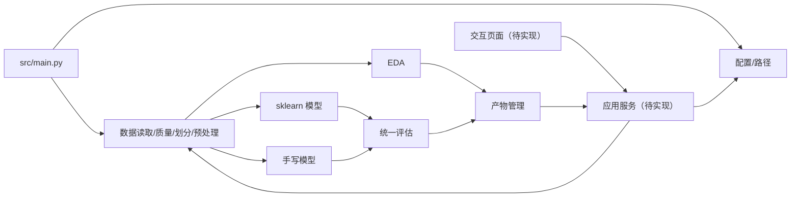

# 系统模块规划

## 当前非 UI 核心实际结构

```text
config/
└── default.yaml
src/
├── main.py
├── application/workflows.py
├── core/{config.py, io.py, paths.py, schema.py}
├── data/{loader.py, audit.py, preparation.py, eda.py}
├── evaluation/{metrics.py, reports.py}
└── model/{sklearn_models.py, manual_logistic.py, manual_mlp.py,
           numerics.py, training.py, predictor.py}
tests/
└── test_*.py
```

`data/obesity_level.csv` 始终只读；划分/预处理元数据位于 `data/processed/`，EDA、四模型、指标和实验总结位于 `outputs/`。真实完整流程运行前后原始文件快照一致。

## 后续阶段规划结构

当前代码按 `application`、`core`、`data`、`evaluation`、`model` 分层。阶段五只新增实际 UI 所需模块，并直接消费 `src/model/predictor.py` 与现有输出，不复制训练逻辑。

## 模块清单

| 模块 | 阶段/状态 | 职责 | 建议文件 | 测试重点 |
|---|---|---|---|---|
| 配置 | 阶段二已实现 | 读取并校验当前 YAML 配置 | `src/core/config.py` | 缺项、类型、比例和关键值 |
| 路径 | 阶段二已实现 | 固定根目录解析、路径防逃逸和原始数据保护 | `src/core/paths.py` | 越界、覆盖、目录冲突、文件缺失 |
| CLI 入口 | 阶段三至四已实现 | 调用七个非 UI 工作流命令 | `src/main.py` | `tests/test_cli.py`、命令错误退出码 |
| 数据读取/质量 | 阶段三已实现 | 只读加载 CSV、Schema 与质量检查、结构化报告 | `src/data/loader.py`、`src/core/schema.py`、`src/data/audit.py`、`src/evaluation/reports.py` | 缺文件、格式错误、输入不变、统计和序列化 |
| 数据划分/预处理 | 阶段三已实现 | 固定分层三分和训练集拟合预处理 | `src/data/preparation.py` | 互斥、复现、无泄漏 |
| EDA/模型/评估/产物 | 阶段三至四已实现 | 分析、四模型训练、统一评估和产物保存 | `src/data/eda.py`、`src/model/training.py`、`src/model/manual_*`、`src/evaluation/metrics.py`、`src/application/workflows.py` | 指标、接口、可复现和公平比较 |
| 预测服务 | 阶段四已实现 | 重载模型并提供单条/批量结构化预测 | `src/model/predictor.py` | schema、概率、错误提示、免责声明 |
| 应用服务/交互页面 | 阶段五未实现 | 五页面展示、训练、预测和比较 | UI 模块尚未创建 | 输入校验、状态、结果和免责声明 |

## 调用关系



## 配置规划

当前 `config/default.yaml` 已包含数据、划分、预处理、训练、优化、EDA 和输出配置；尚未增加 UI 参数。

固定初值候选：`random_seed: 42`、训练/验证/测试 `0.70/0.15/0.15`、目标精确值 `0be1dad`、排除列 `[id]`。数值和类别字段清单必须与数据 schema 校验，不能默默忽略拼写错误。

## 输出规划

- `outputs/eda/figures/`：PNG 图表，当前包含六类 EDA 图。
- `outputs/metrics/`：JSON 指标、CSV 对比、分类报告、混淆矩阵和手写模型训练曲线。
- `outputs/models/`：四类模型、最佳模型 bundle 和部署选择元数据。
- `data/processed/`：划分索引、预处理器、输入字段元数据和清洗摘要。
- 日志保存方式尚未实现，不能把实验产物目录当作日志目录。
- 自动产物默认不与源代码提交混合；报告选用的稳定图表按交付策略另行纳入。

## 测试规划

- 当前测试覆盖配置、路径、数据、EDA、预处理、评估、四类模型、预测器、CLI 和工作流，共 85 项。
- 最近一次指定环境测试结果为 85 passed、0 failed、0 skipped、11 warnings。
- 测试命令统一为 `conda run -p /Users/liang/dev/envs/workspace env PYTHONPATH=src pytest -q`。
- UI 集成测试尚未建立。
