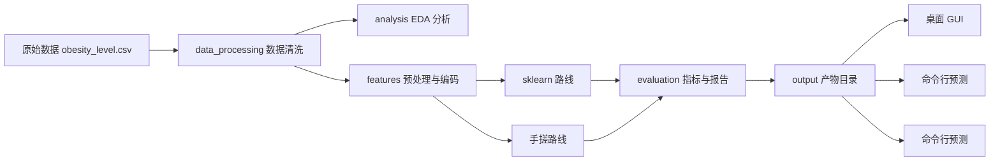
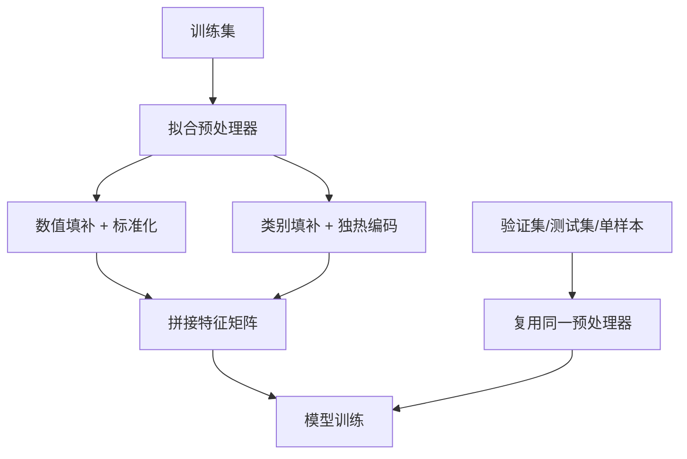
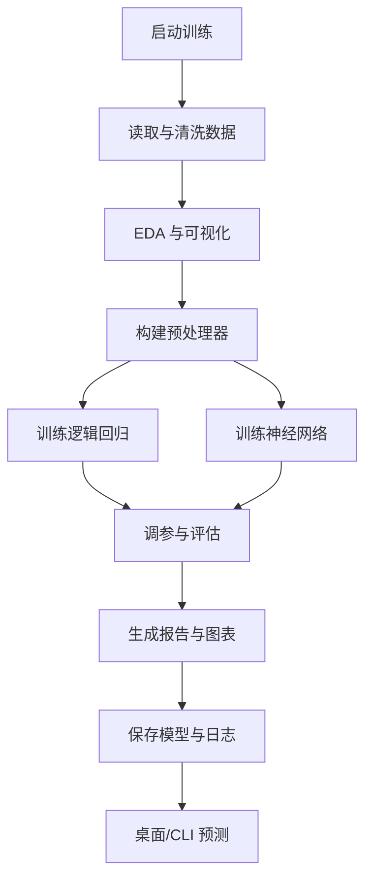

# 肥胖风险预测系统详细设计文档

## 1. 设计背景

本课程设计的题目是“肥胖风险预测系统设计”。根据授课计划 PDF 的要求，项目需要完成以下内容：

- 基于 `sklearn` 的数据预处理、算法实现、性能分析与可视化。
- 基于 Python 的数据读取、模型设计与结果分析。
- 交互界面设计，用于展示预测结果与模型分析过程。
- 形成可汇报、可复现、可答辩的完整课程设计报告。

本仓库以 `data/obesity_level.csv` 为核心数据源，围绕肥胖等级预测建立一套完整的机器学习课程设计方案。设计目标不是只给出一个分类结果，而是把数据清洗、特征工程、模型训练、效果评估、界面展示和报告输出串成一条可演示的完整链路。

> [!summary] 设计结论
> 本项目采用“CRISP-DM 风格的数据挖掘流程 + `scikit-learn` 工程化流水线 + 本地交互式演示界面”的组合方案，主体模型使用逻辑回归和神经网络，既满足课程要求，也便于答辩展示和本地复现。

## 2. 设计依据与方法框架

### 2.1 课程要求映射

| PDF 要求 | 本项目设计 |
|---|---|
| 数据预处理 | 缺失值处理、异常值裁剪、字段标准化、类别编码 |
| 算法实现 | 逻辑回归、神经网络，分别提供 sklearn 路线与手搓路线 |
| 结果性能分析 | 混淆矩阵、准确率、精度、召回率、F1、ROC 曲线 |
| 可视化 | 特征分布图、相关性热力图、训练曲线、模型对比图 |
| Python 完成选题设计 | 全流程使用 Python 实现，结果输出到 `output/` |
| 交互界面设计 | 桌面端和命令行预测均提供预测入口与结果展示 |

### 2.2 成熟方案框架

本设计参考了机器学习项目里常见的成熟框架：

1. **CRISP-DM 风格流程**：按业务理解、数据理解、数据准备、建模、评估、部署的顺序推进。
2. **`scikit-learn` Pipeline 思路**：把预处理、编码、标准化和模型训练放进统一流水线，减少数据泄漏风险。
3. **指标驱动评估思路**：围绕分类任务的混淆矩阵、准确率、精度、召回率和宏平均 F1 做对比。
4. **工程化交付思路**：训练、评估、报告、图表、模型和界面都落在固定目录，便于复现和答辩。

> [!tip] 设计原则
> 课程设计的重点不是堆模型，而是把“为什么这样做、做完如何证明有效、别人如何复现”说清楚。

## 3. 需求分析

### 3.1 业务目标

系统的目标是根据用户的基础身体指标和生活习惯特征，预测其肥胖等级，并给出可解释的分析结果。输出结果既要适合课堂展示，也要适合后续扩展。

### 3.2 功能需求

1. 读取原始 CSV 数据并完成清洗。
2. 对数值特征和类别特征做统一预处理。
3. 完成单变量、双变量、多变量分析。
4. 绘制相关性热力图、分布图、训练曲线和对比图。
5. 使用逻辑回归和神经网络完成肥胖等级分类。
6. 对模型进行参数优化，并输出优化前后对比结果。
7. 通过桌面界面或命令行接口进行预测演示。
8. 自动生成训练摘要、评估报告和日志。

### 3.3 非功能需求

- **可复现**：同一份数据和配置应能得到稳定的训练流程。
- **可解释**：重点特征与输出类别关系清晰，便于答辩说明。
- **可扩展**：后续可替换模型、增加特征或增加新的展示界面。
- **可维护**：训练、分析、推理、展示职责分离，目录清楚。

## 4. 总体架构设计

系统采用“数据层 - 特征层 - 模型层 - 评估层 - 服务层 - 展示层”的分层结构。



### 4.1 模块职责

| 模块 | 主要职责 |
|---|---|
| `src/data_processing` | 数据读取、清洗、拆分 |
| `src/features` | 缺失值填补、标准化、独热编码、特征筛选 |
| `src/analysis` | EDA 摘要、统计结论、特征关系分析 |
| `src/models` | 逻辑回归、神经网络、训练器、模型持久化 |
| `src/evaluation` | 混淆矩阵、准确率、精度、召回率、F1、ROC 等指标 |
| `src/serving` | 推理封装、模型加载、单样本预测 |
| `src/core` | 配置与共享契约 |
| `src/visualization` | 训练曲线、对比图、统计图表 |
| `src/log` | 项目日志、分级输出与追踪 |

## 5. 数据设计

### 5.1 数据来源

- 数据文件：`data/obesity_level.csv`
- 样本规模：20758
- 目标字段：`obesity_level`

### 5.2 特征分类

| 类型 | 字段示例 | 处理方式 |
|---|---|---|
| 数值特征 | 年龄、身高、体重、饮水量、运动评分 | 缺失值处理、异常值裁剪、标准化 |
| 类别特征 | 性别、饮食频率、饮酒频率、出行方式 | 统一类别命名、独热编码 |
| 二值特征 | 家族肥胖史、吸烟、热量监控 | 保持 0/1 编码 |
| 标签特征 | 肥胖等级 | 类别编码为整数索引 |

### 5.3 数据清洗策略

1. 修正原始数据中的异常字段名和标签名。
2. 对类别字段中的非规范值做统一映射。
3. 对明显异常的数值进行区间裁剪，降低录入噪声影响。
4. 对缺失值采用合理填补策略，避免模型训练中断。
5. 保留原始字段和清洗后字段的对应关系，方便写报告说明。

### 5.4 特征工程设计

项目在原始字段基础上补充了若干解释性特征，用于增强肥胖风险的表达能力：

- `bmi`：由体重和身高计算得到，用于刻画体型水平。
- `sedentary_transport`：是否属于久坐型出行。
- `snacking_score`：由加餐频率映射得到的风险分值。
- `alcohol_score`：由饮酒频率映射得到的风险分值。
- `behavior_risk_score`：综合行为风险分值。

> [!info] 设计说明
> 肥胖风险预测属于典型的表格型分类问题，少量高质量衍生特征通常比盲目增加复杂模型更有效。

## 6. 模型设计

### 6.1 模型选型理由

课程要求明确提出“逻辑回归、神经网络完成数据分析”。本项目据此选择两类主模型：

1. **逻辑回归**：作为强基线模型，优点是训练快、结果稳定、可解释性强。
2. **神经网络**：用于验证非线性建模能力，观察其与逻辑回归的性能差异。

在工程实现上，项目同时提供两条训练路线：

- `sklearn` 路线：采用 `LogisticRegression` 和 `MLPClassifier`。
- 手搓路线：采用自实现的多分类逻辑回归和单隐层神经网络。

这样做的好处是，既能展示“成熟框架下的工程实现”，也能展示“算法原理层面的独立实现”。

### 6.2 预处理流水线

预处理采用 `Pipeline` / `ColumnTransformer` 的组织方式：

1. 数值特征先做缺失值填补，再做标准化。
2. 类别特征先做缺失值处理，再做独热编码。
3. 标签单独编码，避免把标签混入特征处理流程。
4. 预处理器只在训练集上拟合，验证集和测试集复用同一套转换器。



### 6.3 逻辑回归设计

逻辑回归用于多分类肥胖等级预测，优势是：

- 训练速度快，适合作为课程设计的可解释基线。
- 权重系数可分析，便于说明哪些特征影响较大。
- 在表格数据上通常有不错的稳定性。

优化方向包括：

- 正则化强度搜索。
- 迭代轮数搜索。
- 多分类策略和求解器选择。

### 6.4 神经网络设计

神经网络用于学习非线性特征交互，重点不是追求极深结构，而是验证模型表达能力。设计上采用轻量结构，避免因数据规模和训练成本过高影响课程展示。

优化方向包括：

- 隐藏层规模。
- 学习率。
- 批量大小。
- 迭代轮数。
- 正则化项或早停策略。

### 6.5 训练与调参策略

1. 划分训练集、验证集和测试集。
2. 先训练 baseline 模型，得到起点表现。
3. 基于网格搜索或参数组合搜索寻找更优参数。
4. 使用验证集选择最优参数。
5. 在测试集上做最终评估。
6. 保存模型、预测结果、图表和报告。

### 6.6 评价指标

分类任务主要采用以下指标：

| 指标 | 作用 |
|---|---|
| 混淆矩阵 | 查看各类别预测分布和混淆关系 |
| 准确率 | 评估整体预测正确比例 |
| 精度 | 评估预测为某类时的可靠程度 |
| 召回率 | 评估某类样本被识别出的程度 |
| F1 | 平衡精度与召回率 |
| ROC / AUC | 辅助观察多分类分离能力 |

> [!warning] 评估注意点
> 肥胖等级是多分类问题，只看准确率容易掩盖类别不平衡带来的偏差，因此必须结合混淆矩阵、精度、召回率和宏平均 F1 一起看。

## 7. 结果分析设计

### 7.1 EDA 分析内容

项目对年龄、身高、体重等数值变量做单变量、双变量和多变量分析，重点观察：

- 不同肥胖等级的体型分布差异。
- 生活方式特征与肥胖等级的相关趋势。
- 特征之间的共线关系和冗余信息。

### 7.2 可视化产物

| 图表 | 用途 |
|---|---|
| 相关性热力图 | 观察数值特征之间的相关关系 |
| 分布图 / 箱线图 | 分析类别之间的分布差异 |
| 混淆矩阵 | 观察误判集中在哪些类别 |
| 训练曲线 | 分析收敛速度和稳定性 |
| 对比图 | 对比 baseline 与优化后模型 |

### 7.3 结果解释方式

结果解释不只展示分数，还要说明：

1. 哪些特征更容易区分肥胖等级。
2. 哪些类别容易混淆，原因是什么。
3. 逻辑回归和神经网络各自的优势和局限。
4. 优化后模型相对于 baseline 是否有实际提升。

## 8. 交互界面设计

### 8.1 界面目标

界面的目标是让老师在演示时可以快速完成“输入样本 - 查看预测 - 查看解释 - 查看模型结果”的闭环。

### 8.2 界面构成

| 界面 | 定位 | 主要功能 |
|---|---|---|
| 桌面 GUI | 本地交互管理 | 数据查看、训练状态、预测演示 |
| 命令行预测 | 脚本演示 | 单样本预测、结果输出 |
| CLI | 调试与复现 | 执行训练、查看帮助、输入样本预测 |

### 8.3 接口输出

预测结果统一返回：

- 预测类别。
- 各类别概率。
- 推荐模型或推荐结果。
- 训练摘要入口。

## 9. 系统流程设计



## 10. 目录与产物设计

### 10.1 目录结构

```text
src/
├── data_processing/
├── features/
├── log/
├── models/
├── serving/
├── utils/
├── reporting.py
├── visualization.py
└── ui/
    └── desktop.py
output/
├── analysis/
├── evaluation/
├── figures/
├── logs/
├── models/
├── predictions/
└── reports/
docs/
```

### 10.2 关键产物

| 产物 | 内容 |
|---|---|
| `output/logs/project.log` | 项目运行日志 |
| `output/reports/final_summary.md` | 最终训练与评估摘要 |
| `output/reports/family_comparison_report.md` | 模型家族对比报告 |
| `output/evaluation/training_dashboard.json` | 训练摘要结构化数据 |
| `output/models/` | 训练完成后的模型与预处理器 |
| `output/figures/` | 图表、混淆矩阵、训练曲线、对比图 |

## 11. 测试与验证设计

### 11.1 测试层级

1. **单元测试**：验证数据清洗、特征处理和基础模型函数。
2. **集成测试**：验证完整训练链路是否能跑通。
3. **接口测试**：验证命令行预测返回结构是否正确。
4. **演示测试**：验证课堂展示流程是否能稳定完成。

### 11.2 验证重点

- 数据文件是否正确读取。
- 训练是否能正常输出模型文件和图表。
- 预测接口是否能同时返回逻辑回归与神经网络结果。
- 结果报告是否能支撑答辩讲解。

## 12. 风险分析与应对

| 风险 | 触发条件 | 影响 | 应对措施 |
|---|---|---|---|
| 类别不平衡 | 某些肥胖等级样本偏少 | 指标偏高但泛化不足 | 使用宏平均指标，结合混淆矩阵分析 |
| 数据噪声 | 录入值异常或类别拼写不规范 | 训练结果波动 | 做字段清洗、区间裁剪和类别映射 |
| 过拟合 | 神经网络容量过大 | 测试集表现下降 | 控制模型规模，增加验证集选择 |
| 演示中断 | 界面或模型文件缺失 | 答辩演示失败 | 保留 CLI 兜底路径和训练产物检查 |
| 结果难解释 | 只展示分数不讲原因 | 报告说服力不足 | 同时输出特征解释、混淆矩阵和对比图 |

## 13. 结论

本设计文档把课设要求拆解成“数据处理 - 模型训练 - 效果评估 - 交互展示 - 报告输出”五个核心环节，并用成熟机器学习项目常用的流程和工程化组织方式把它们串联起来。该方案既满足课程任务中的功能要求，也能支撑最终报告、PPT 汇报和现场演示。

## 14. 参考资料

1. [scikit-learn: Pipelines and composite estimators](https://scikit-learn.org/stable/modules/compose.html)
2. [scikit-learn: Model evaluation](https://scikit-learn.org/stable/modules/model_evaluation.html)
3. [scikit-learn: `confusion_matrix`](https://scikit-learn.org/stable/modules/generated/sklearn.metrics.confusion_matrix.html)
4. [CRISP-ML(Q): A Machine Learning Process Model with Quality Assurance Methodology](https://arxiv.org/abs/2003.05155)
5. 本仓库 `docs/人工智能综合实践课程设计授课计划.pdf`
